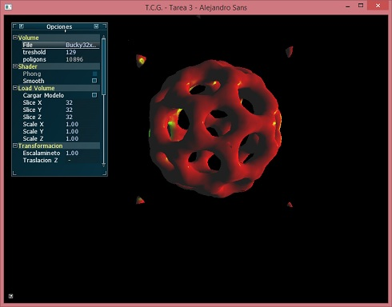

# Marching Cubes
This is a project created by Alejandro Sans (sansalejandro@gmail.com) for a Computer Graphic course (Universidad Central de Venezuela). 

This project show the technique Marching Cubes and its illumanation.

To load a volume, you must have a .raw file and know the number of slices in each axis and insert them on the fields "Slice X", "Slice Y", and "Slice Z". After that, click the button "Cargar Modelo". It should open an explorer and you should select the .raw files with those dimensions

This project has included 2 .raw files on the folder "MarchingCubes/files/Modelos"
# Compiling

This project requires compiling with visual studio 2015 and the following external libraries:

* [FreeGLUT] 3.0.0-2
* [AntTweakBar] 1.16
* [GLEW] 2.0.0
* [glm] 0.9.8.4

To compile in visual studio, the header files must be on a "tools" folder that must be created in the "MarchingCubes" folder. The headers should be included as follow:

    - MarchingCubes/tools/GL (FreeGlut and GLEW)
    - MarchingCubes/tools/AntTweakBar (AntTweakBar)
    - MarchingCubes/tools/glm (glm)
    
The [glm] folder must contain all the files in the folder "glm" of the library (this includes detail, gtc, gtx and simd)

The libraries must be on a folder "lib" that must be created in the "MarchingCubes" folder as follow:
- MarchingCubes/lib

And the dll should be include on the folder "MarchingCubes",

# Image

Here is an image of the application

   [video]: <https://vimeo.com/37664294>
   [SDL]: <https://www.libsdl.org/>
   [SDL_mixer]: <https://www.libsdl.org/projects/SDL_mixer/>
   [FreeGLUT]: <http://freeglut.sourceforge.net/>
   [FreeImage]: <http://freeimage.sourceforge.net/>
   [AntTweakBar]: <http://anttweakbar.sourceforge.net/doc/>
   [GLEW]: <http://glew.sourceforge.net/>
   [glm]: <http://glm.g-truc.net/0.9.8/index.html>
